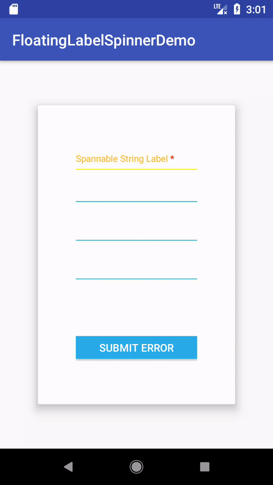

# FloatingLabelSpinnerDemo

## Reference
[FloatingLabelSpinner](https://github.com/james602152002/FloatingLabelSpinner)

## Demonstration

|Recursive Mode Spinner|
|:---:|
||

## Dependency

```
allprojects {
	repositories {
		...
		maven { url 'https://jitpack.io' }
	}
}

```

```
dependencies {
	compile 'com.github.james602152002:FloatingLabelSpinner:1.1.5'
}
```

## Property

```xml
<com.james602152002.floatinglabelspinner.FloatingLabelSpinner
          android:layout_width="match_parent"
          android:layout_height="wrap_content"
          //floating label and hint text color
          app:j_fls_textColorHint="@android:color/holo_orange_light" 
          //divider color
          app:j_fls_colorHighlight="#0000FF" 
          //error color
          app:j_fls_colorError="#0000FF"
          //floating label text
          app:j_fls_hint="label"
          //thickness of divider
          app:j_fls_thickness="2dp"
          //horizontal margin of label
          app: j_fls_label_horizontal_margin="2dp"
          //vertical margin of label
          app: j_fls_label_vertical_margin="2dp"
          //horizontal margin of error text
          app: j_fls_error_horizontal_margin="2dp"
          //vertical margin of error text
          app: j_fls_error_vertical_margin="2dp"
          //floating label text size
          app: j_fls_label_textSize="14sp"
          //hint text size
          app:j_fls_hint_textSize="20sp"
          //error text size
          app:j_fls_error_textSize="14sp"
          //header of drop down hint view
          app:j_fls_dropDownHintView="@layout/header"
          //float animation duration(unit：ms)
          app:j_fls_float_anim_duration="800"
          //scrolling text animation duration(unit：ms)
          app:j_fls_error_anim_duration="8000"
          //open recursive mode(false to close)
          app:j_fls_recursive="true"
          
```

## Method
```java
    	//floating label text size
	setLabel_text_size(float label_text_size);
	//hint text size
	setHint_text_size(float hint_text_size);
	//error text size
	setError_text_size(float error_text_size);
	//thichness of divider
	setThickness(int thickness);
	//divider color
	setHighlight_color(int color);
	//hint text color
	setHint_text_color(int color);
	//error color
	setError_color(int color);
	//set error text horizontal and vertical margin
	setErrorMargin(int horizontal_margin, int vertical_margin);
	//set float label text and hint text(Support ForegroundColorSpan)
	spinner.setHint(CharSequence hint);
	//set drop down hint view header
	spinner.setDropDownHintView(View view);
	//set error text(null for cancel error status)
	setError(String error);
	//set float animation duration(unit：ms)
        setAnimDuration(short duration)
        //set scrolling text animation duration(unit：ms)
        setErrorAnimDuration(short duration)
        //set recursive mode, if you have many level data to fetch , you can set it true.
        setRecursive_mode(boolean recursive_mode)
        //dismiss dialog while recursive mode
        dismiss()
        //notify datasetchanged while recursive mode
        notifyDataSetChanged()
	
```

## Demonstration

#### Cache

```java
    public class MainActivity extends AppCompatActivity implements View.OnClickListener {

    private FloatingLabelSpinner spinner;
    private List<String> data = new ArrayList<>();
```

#### Init view
```java
        @Override
        protected void onCreate(Bundle savedInstanceState) {
                super.onCreate(savedInstanceState);
                setContentView(R.layout.activity_main);
        
                spinner = findViewById(R.id.spinner);
        
                final int screen_width = getResources().getDisplayMetrics().widthPixels;
                final float label_text_size = screen_width / 40;
                final float hint_text_size = screen_width / 30;
                final short thickness = (short) (screen_width / 250);
                spinner.setLabel_text_size(label_text_size);
                spinner.setHint_text_size(hint_text_size);
                spinner.setError_text_size(label_text_size);
                spinner.setThickness(thickness);
                spinner.setHighlight_color(Color.parseColor("#FFFF00"));
                spinner.setErrorMargin(0, thickness);
                spinner.setDropDownHintView(getHintView());
        
                //set your hint as ForegroundColorSpan
                SpannableString span = new SpannableString("Spannable String Label *");
                span.setSpan(new ForegroundColorSpan(Color.RED), span.length() - 1, span.length(), Spanned.SPAN_EXCLUSIVE_EXCLUSIVE);
                spinner.setHint(span);
                fetchData();
        
                adapter = new CommonMaterialSpinnerAdapter(this, data);
                spinner.setAdapter(adapter);
        
                spinner.setOnItemSelectedListener(new AdapterView.OnItemSelectedListener() {
                    @Override
                    public void onItemSelected(AdapterView<?> parent, View view, int position, long id) {
                        //Dismiss spinner when you click drop down hint view header.
                        if (position == 0) {
                            spinner.dismiss();
                            return;
                        }
                        switch (current_node) {
                            case 0:
                                //Fetch second class data and don't dismiss.
                                fetch2ndClassData();
                                break;
                            case 1:
                                //When you current in second class just dismiss your dialog.
                                spinner.dismiss();
                                return;
                        }
                        current_node++;
                        //Set drop down hint view with back button.
                        spinner.setDropDownHintView(getHintView());
                    }
        
                    @Override
                    public void onNothingSelected(AdapterView<?> parent) {
        
                    }
                });
        
                initDivider(thickness);
                initButton();
        }
```

```java
    private void initDivider(short divider_height) {
        View divider_1 = findViewById(R.id.divider_1);
        View divider_2 = findViewById(R.id.divider_2);
        View divider_3 = findViewById(R.id.divider_3);

        ((LinearLayout.LayoutParams) divider_1.getLayoutParams()).height = divider_height;
        ((LinearLayout.LayoutParams) divider_2.getLayoutParams()).height = divider_height;
        ((LinearLayout.LayoutParams) divider_3.getLayoutParams()).height = divider_height;
    }

    private void initButton() {
        Button submit_button = findViewById(R.id.submit);
        submit_button.setOnClickListener(this);
    }

    /*This method to set your hint view*/
    public View getHintView() {
            final int screen_width = getResources().getDisplayMetrics().widthPixels;
            final float label_text_size = screen_width / 40;
            final short margins = (short) (screen_width / 40);
            final short rect_height = (short) (screen_width / 60);
            View hintView = getLayoutInflater().inflate(R.layout.header_of_spinner, null, false);
            TextView title = hintView.findViewById(R.id.title);
            AppCompatImageView back = hintView.findViewById(R.id.back);
            View rect = hintView.findViewById(R.id.rect);
    
            ((RelativeLayout.LayoutParams) rect.getLayoutParams()).height = rect_height;
            rect.setBackgroundColor(getResources().getColor(android.R.color.holo_blue_dark));
            ((RelativeLayout.LayoutParams) title.getLayoutParams()).setMargins(margins, margins, margins, margins);
            hintView.setBackgroundColor(getResources().getColor(android.R.color.holo_blue_light));
            title.setTextSize(TypedValue.COMPLEX_UNIT_PX, label_text_size);
            ((RelativeLayout.LayoutParams) back.getLayoutParams()).setMargins(margins, 0, margins, 0);
            back.setOnClickListener(this);
    
            switch (current_node) {
                case 0:
                    back.setVisibility(View.GONE);
                    break;
                default:
                    back.setVisibility(View.VISIBLE);
                    break;
            }
            return hintView;
    }
```

#### Fetch data

```java
       private void fetchData() {
           data.clear();
           String itemStr = "Item ";
           StringBuilder itemBuilder = new StringBuilder();
           for (int i = 0; i < 5; i++) {
               itemBuilder.delete(0, itemBuilder.length());
               itemBuilder.append(itemStr).append(i);
               data.add(itemBuilder.toString());
           }
           spinner.notifyDataSetChanged();
       }
```

```java
       private void fetch2ndClassData() {
            data.clear();
            String itemStr = "2nd class item ";
            StringBuilder itemBuilder = new StringBuilder();
            for (int i = 0; i < 4; i++) {
                itemBuilder.delete(0, itemBuilder.length());
                itemBuilder.append(itemStr).append(i);
                data.add(itemBuilder.toString());
            }
            spinner.notifyDataSetChanged();
       }
```

#### Customize your adapter

```java
 /*
    * Spinner's height depends on getView()'s height,
    * and dropDownView are items of Dialog.
    * */
    class CommonMaterialSpinnerAdapter extends BaseAdapter {

        private final List<String> data;
        private final LayoutInflater inflater;
        private final short drop_down_margins;
        private final short margin;
        private final float item_text_size;

        public CommonMaterialSpinnerAdapter(Context context, List<String> data) {
            this.data = data;
            this.inflater = LayoutInflater.from(context);
            final int screen_width = getResources().getDisplayMetrics().widthPixels;
            this.drop_down_margins = (short) (screen_width / 40);
            this.margin = (short) (screen_width / 75);
            this.item_text_size = screen_width / 30;
        }


        @Override
        public View getDropDownView(int position, View convertView, ViewGroup parent) {
            return initView(position, convertView, true);
        }

        @Override
        public void registerDataSetObserver(DataSetObserver observer) {

        }

        @Override
        public void unregisterDataSetObserver(DataSetObserver observer) {

        }

        @Override
        public int getCount() {
            return data != null ? data.size() : 0;
        }

        @Override
        public Object getItem(int position) {
            return null;
        }

        @Override
        public long getItemId(int position) {
            return 0;
        }

        @Override
        public boolean hasStableIds() {
            return false;
        }

        @Override
        public View getView(int position, View convertView, ViewGroup parent) {
            return initView(position, convertView, false);
        }

        @Override
        public int getItemViewType(int position) {
            return 0;
        }

        @Override
        public boolean isEmpty() {
            return true;
        }

        private View initView(int position, View convertView, boolean drop_down) {
            ViewHolder holder = null;
            if (convertView == null) {
                holder = new ViewHolder();
                convertView = inflater.inflate(R.layout.cell_common_spinner_layout, null, false);
                holder.title = convertView.findViewById(R.id.title);
                if (drop_down) {
                    ((LinearLayout.LayoutParams) holder.title.getLayoutParams()).setMargins(drop_down_margins, drop_down_margins, drop_down_margins, drop_down_margins);
                } else {
                    ((LinearLayout.LayoutParams) holder.title.getLayoutParams()).setMargins(0, margin, 0, margin);
                    convertView.setBackgroundColor(0);
                }
                holder.title.setTextSize(TypedValue.COMPLEX_UNIT_PX, item_text_size);
                convertView.setTag(holder);
            } else {
                holder = (ViewHolder) convertView.getTag();
            }
            holder.title.setText(data.get(position));
            return convertView;
        }

        class ViewHolder {
            TextView title;
        }
    }
```

#### And set your listener to check error status

```java
    @Override
    public void onClick(View v) {
         switch (v.getId()) {
                case R.id.submit:
                    //If your set null to error status will cancel.
                    spinner.setError(TextUtils.isEmpty(spinner.getError()) ? "begin error end" :
                            "begin error error error error error error error error error error error end");
                    break;
                case R.id.back:
                    //Back to first level class.
                    current_node--;
                    fetchData();
                    //Reset drop down hint view.
                    spinner.setDropDownHintView(getHintView());
                    break;
         }
    }
```
